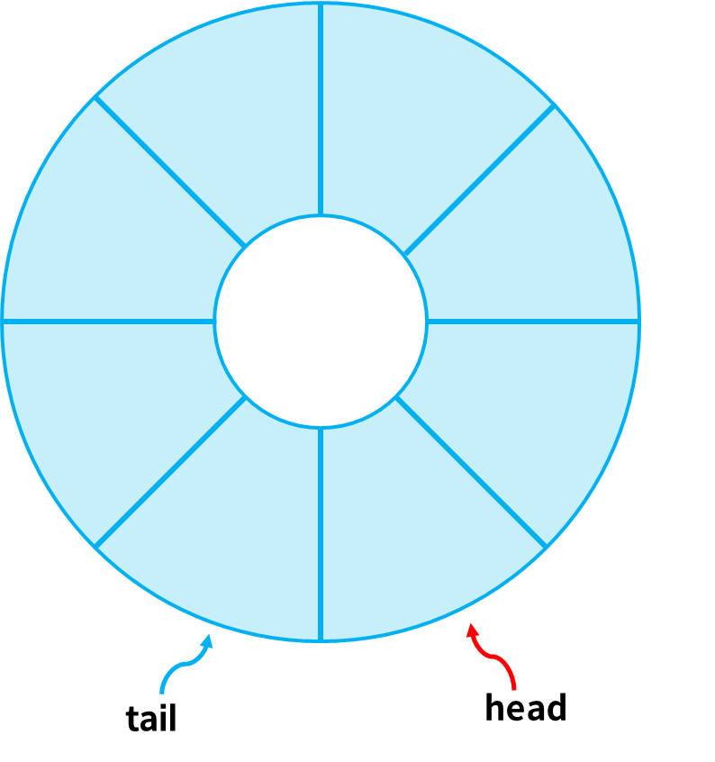

# 원형 큐



실제로 원형으로 만드는 것은 아님

head, tail이 배열의 마지막 인덱스에 도달할 시 다시 배열의 첫 인덱스로 돌려서 큐가 **원형으로 구성된 것 처럼** 보이게 하는 것

만약 큐의 크기가 5일 때,<br>
해당 queue 배열의 인덱스 범위는 0~4
만약 인덱스가 큐의 크기가 될 경우 다시 0으로 돌려줘야함
=> 모듈로 연산 % (Modulo Operation) 이용!

#### 구현
```java
public class CircularQueue {
    static int[] queue = new int[5];
    static int head = 0;
    static int tail = 0;

    static boolean isEmpty() {
        return head == tail;
    }

    static boolean isFull() {
        return tail >= queue.length -1;
    }

    static void enqueue(int item) {
        if (isFull()) {
            System.out.println("큐에 더이상 데이터를 넣을 수 없습니다.");
        }
        tail = (tail + 1) % queue.length;
        queue[tail] = item;
    }

    static int dequeue() {
        if (isEmpty()) {
            System.out.println("큐가 비어있습니다.");
            return -1;
        }
        head = (head + 1) % queue.length;
        return queue[head];
    }

    public static void main(String[] args) {
        enqueue(1);
        enqueue(2);
        enqueue(3);
        System.out.println("pop: " + dequeue());
        System.out.println("pop: " + dequeue());
        System.out.println("pop: " + dequeue());

        enqueue(4);
        enqueue(5);
        enqueue(6);
        System.out.println("pop: " + dequeue());
        System.out.println("pop: " + dequeue());
        System.out.println("pop: " + dequeue());

        enqueue(7);
        enqueue(8);
        enqueue(9);
        System.out.println("pop: " + dequeue());
        System.out.println("pop: " + dequeue());
        System.out.println("pop: " + dequeue());
    }

}
```
기존의 선형 큐는 단순 배열이어서 배열의 크기까지만 데이터 할당 가능했지만

원형큐는 다시 인덱스를 배열의 처음으로 되돌려서 반복하므로 공간만 충분하다면 계속해서 데이터 넣을 수 있음

### 큐 이용
- 인쇄처럼 우선순위가 필요한 대기열
- 선입선출이 필요한 대기열
- 윈도우의 스케쥴링 시스템 등

나중에 배울 BFS, 너비 우선 탐색에서 처리할 노드 리스트 저장 용도로도 사용


