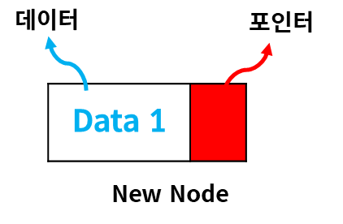
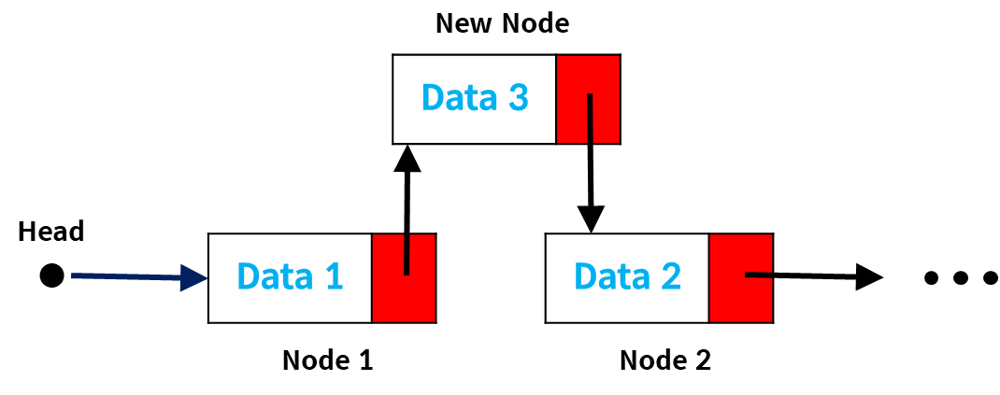

# 연결 리스트
data, pointer 로 구성된 노드를 한 줄로 연결해 데이터 저장


Head에서 시작
- Head: Node 1의 주소값 가짐

### 노드 구조


- Data: 그 노드에 저장할 데이터
- Pointer: 다음 노드의 주소 값

node1의 포인터로 node2에 접근<br>
node2의 포인터로 node3에 접근<br>... 반복

### 링크드 리스트 장/단점

#### 장점
**1. 크기 미리 할당할 필요X**
   <br><br>
    배열의 경우 항상 크기를 미리 지정해야함 <br>
    링크드리스트의 경우 크기를 지정하지 않고 단순히 현재 노드의 포인터에 다음 노드의 주소값만 대입하면 됨
   <br><br>
**2. 수정 시, 시간복잡도 = O(1)**

   

중간에 데이터 추가 시, node1의 포인터를 새로운 노드의 주소값으로 제공하고,<br>
    새로운 노드의 포인터를 node2의 주소값으로 제공
   <br><br>
    새로운 데이터가 추가되어도 연관된 두 노드를 제외한 나머지 노드에 영향XXX<br>
    => 언제나 일정한 시간 소요 = O(1)
   <br><br><br>
#### 단점
**1. 추가적인 저장공간 필요**
   <br><br>
    기존 배열은 데이터만 저장하면 되지만 링크드리스트는 포인터도 저장해야함<br>
    => 저장공간 효율성 떨어짐

**2. 정보 가져오는 시간복잡도 O(n)**
   <br><br>
    마지막 데이터 접근 시<br><br>
    배열의 경우 `array[lastIdx]` -> _**O(1)**_<br>
    링크드리스트의 경우 바로 접근할 방법X -> **_O(n)_**<br>

즉, 데이터의 조회보단, **삽입 삭제가 빈번한 곳**에서 사용하는 것이 유리함

### 구현
- `append(value)` -> 링크드리스트의 마지막에 데이터 추가 
- `insert(value, idx)` -> 링크드리스트의 idx 위치에 데이터 추가 
- `delete(idx)` -> 링크드리스트의 idx 위치의 노드 제거
- `get(idx)` -> 링크드리스트의 idx 위치의 노드 가져옴

- `printLinkedList()` -> 링크드 리스트의 모든 요소 출력

```java
class Node {
    public Object data;
    public Node pointer;

    public Node(Object input) {
        this.data = input;
        this.pointer = null;
    }
}

public class LinkedList {

    private Node head = new Node(null);

    /**
     * head 부터 index 위치까지 존재하는 모든 노드 리턴
     */
    public Node get(int index) {
        Node node = this.head.pointer;

        while (true) {
            if (index == 0) return node;

            if (node == null) {
                System.out.println("Index Error");
                return null;
            }
            node = node.pointer;
            index--;
        }
    }

    /**
     * 링크드리스트 마지막 노드에 새로운 노드 추가
     */
    public void append(int data) {
        Node node = head;
        Node newNode = new Node(data);
        // 마지막 요소까지 탐색
        while (true) {
            if (node.pointer == null) break;
            node = node.pointer;
        }
        node.pointer = newNode;
    }

    /**
     * 링크드리스트에서 인덱스 위치에 새로운 노드 추가
     */
    public void insert(int data, int index) {
        Node node = head;
        // 새로운 노드 설정
        Node newNode = new Node(data);
        // 무한반복문 통해 인덱스 위치까지 쭉 내려감
        while(true) {
            // 현재 노드가 null 이면, 링크드리스트 사이즈보다 큰 인덱스값이 들어온 것
            if (node == null) {
                System.out.println("Index Error");
                return;
            }
            // 인덱스가 0이면 해당 위치에 새로운 노드 삽입
            if (index == 0) {
                Node nextNode = node.pointer;
                node.pointer = newNode;
                newNode.pointer = nextNode;
                break;
            }
            //인덱스가 0이 아니면 노드를 타고 내려감
            node = node.pointer;
            index--;
        }
    }
    
    /**
     * 링크드리스트의 인덱스 위치에 존재하는 모든 노드 제거
     */
    void delete(int index) {
        if (index == 0) {
            head.pointer = head.pointer.pointer;
        } else {
            // get 이용해 인덱스 위치의 데이터 얻어옴
            Node node = get(index - 1);
            node.pointer = node.pointer.pointer;
        }
    }

    void printLinkedList() {
        Node node = head.pointer;
        while (node != null) {
            if (node.pointer != null) {
                System.out.print(node.data + " -> ");
            } else {
                System.out.print(node.data);
            }
            node = node.pointer;
        }
    }

    public static void main(String[] args) {
        LinkedList ll = new LinkedList();

        ll.append(1);
        ll.append(2);
        ll.append(3);
        ll.printLinkedList();
        // 1 -> 2 -> 3

        ll.insert(10, 0);
        ll.printLinkedList();
        // 10 -> 1 -> 2 -> 3

        ll.insert(20, 3);
        ll.printLinkedList();
        // 10 -> 1[=index1] -> 2 -> 20 -> 3

        ll.delete(1);
        ll.printLinkedList();
        // 10[=index0] -> 2 -> 20 -> 3

        
        ll.delete(0);
        ll.printLinkedList();
        // 2 -> 20 -> 3
    }
}
```
