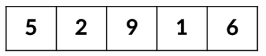
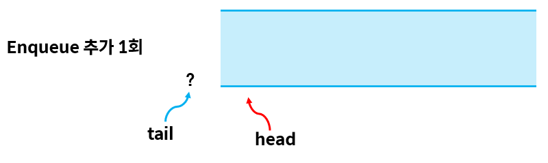
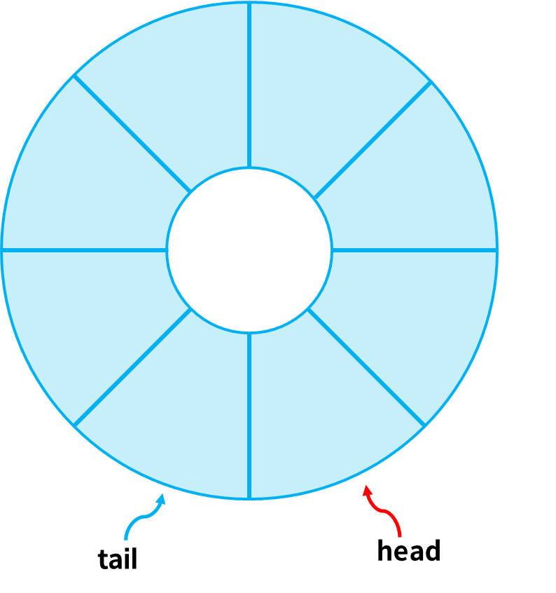

# 큐

### 스택 vs 큐

|                       스택                       |                         큐                          |
|:----------------------------------------------:|:--------------------------------------------------:|
|                   후입선출(LIFO)                   |                     선입선출(FIFO)                     |
|  |  |
|             마지막 입력된 데이터의 위치 (top)              |           최근 삽입된 데이터의 위치, 가장 오래된 데이터의 위치           |

### 큐 구현
데이터 삽입, 추출 두 가지 함수 필요

- 삽입: 큐가 가득 찼는지 확인 -> 최근 삽입된 데이터의 위치 필요
- 추출: 큐가 비어있는지 확인 -> 가장 오래된 데이터의 위치 필요

#### 선형 큐
```java
public class Queue {

    static int[] queue = new int[3];
    static int head = -1;  // 가장 오래된 데이터 위치
    static int tail = -1;  // 최근 추가된 데이터 위치

    static boolean isEmpty() {
        return head == tail;
    }

    static boolean isFull() {
        return tail >= queue.length -1;
    }

    static void enqueue(int item) {
        if (isFull()) {
            System.out.println("큐에 더이상 데이터를 넣을 수 없습니다.");
        } else {
            queue[++tail] = item;
        }
    }

    static int dequeue() {
        if (isEmpty()) {
            System.out.println("큐가 비어있습니다.");
            return 0;
        } else {
            return queue[++head];
        }
    }

    public static void main(String[] args) {
        enqueue(1);
        enqueue(2);
        enqueue(3);
        System.out.println("pop: " + dequeue());
        System.out.println("pop: " + dequeue());
        System.out.println("pop: " + dequeue());
    }

}
```

**결과**
```
pop: 1
pop: 2
pop: 3
```

### 선형 큐의 문제점
BUT, 위에서 작성한 큐가 정말 정상적으로 작동하는 큐인지??

```java
public static void main(String[] args) {
    enqueue(1);
    enqueue(2);
    enqueue(3);
    System.out.println("pop: " + dequeue());
    System.out.println("pop: " + dequeue());
    System.out.println("pop: " + dequeue());

    enqueue(1);
    enqueue(2);
}
```
위에서 작성한 코드를 지금처럼 실행시키면 다음과 같은 결과 출력
```
pop: 1
pop: 2
pop: 3
큐에 더이상 데이터를 넣을 수 없습니다.
큐에 더이상 데이터를 넣을 수 없습니다.
```

이론상 `dequeue()` 를 통해 큐가 비워진 상태이기 때문에 큐에 새로 데이터가 들어가야함<br>
하지만 더이상 데이터를 넣을 수 없다는 결과 추출

=> 왜??

`enqueue()` 메서드는 큐의 빈 자리에 데이터를 넣는 것이 아니라 tail의 다음 위치에 데이터를 넣는 함수<br>
때문에 이런 문제가 발생한 것!



#### 해결방법
큐를 원형으로 만들어 해결!



큐를 원형으로 만들면 데이터를 아무리 삽입해도 다시 제자리로 돌아오게됨

가득 차지 않는 이상 데이터를 계속해서 삽입 가능함


