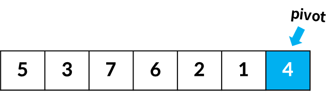
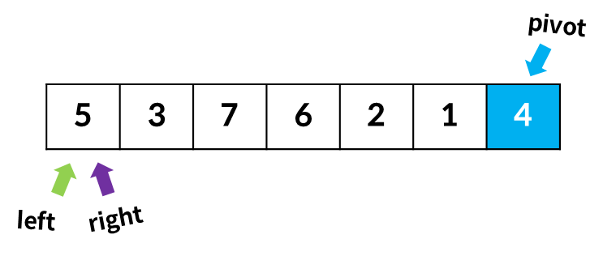
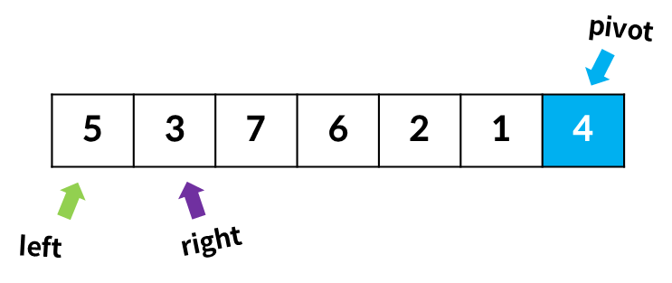
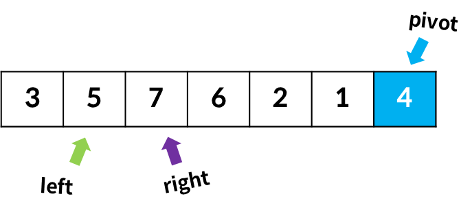
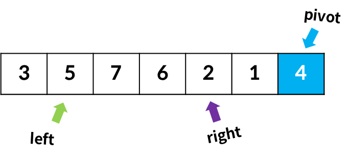
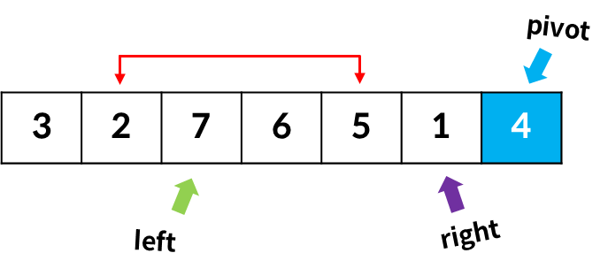
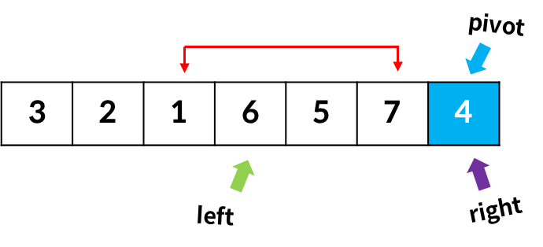
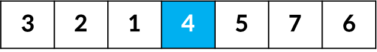
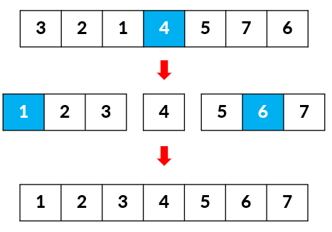
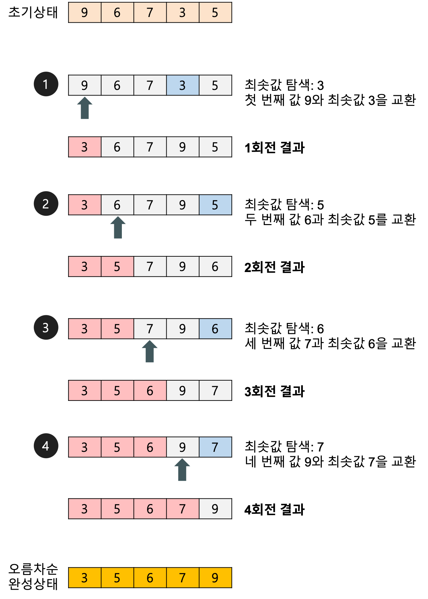

# 정렬 알고리즘

### 정렬
Data가 주어졌을 때, 정해진 순서로 나열하는 행위

효율적인 알고리즘의 대부분이 데이터의 정렬상태를 요구

## Bubble sort 버블정렬

### 버블 정렬 알고리즘
기본적으로 오름차순으로 정렬

인접한 두 값 비교, 큰 수가 오른쪽에 있도록 값을 세팅

-> 배열의 0번째부터 마지막 인덱스까지 진행

이 과정을 한 번 수행하면 _배열에서 가장 큰 값이 마지막 인덱스 위치로 이동_ => 스캔

해당 스캔 작업을 모든 숫자가 정렬될 때까지 반복수행하는 알고리즘

### 코드 구현
```java
public class BubbleSorting {

    public static void main(String[] args) {
        int[] arr = {5, 2, 9, 1, 6};
        int length = arr.length;
        System.out.println("정렬 전 배열: " + Arrays.toString(arr));

        print_arr(arr, length);
        System.out.println("정렬 후 배열: " + Arrays.toString(arr));
    }

    public static void print_arr(int[] arr, int length) {
        int temp = 0;
        for (int i = 0; i < length; i++) {
            for (int j = 0; j < length -i -1; j++) {
                if (arr[j] > arr[j+1]) {
                    temp = arr[j+1];
                    arr[j+1] = arr[j];
                    arr[j] = temp;
                }
            }
        }
    }
}
```

버블 정렬은 인접한 값만 계속해서 비교 -> 상대적으로 구현이 쉬움

BUT **버블정렬은 무조건 O(n^2)의 복잡도** 를 가짐
```
✅ 배열의 개수가 5
▶ j는 4, 3, 2, 1의 범위를 가지므로, 연산량은 1 + 2 + 3 + 4

✅ 배열의 개수가 6
▶ j는 5, 4, 3, 2, 1의 범위를 가지므로, 연산량은 1 + 2 + 3 + 4

✅ 배열의 개수가 n
▶ j는 n-1, n-2, ... 2, 1의 범위를 가지므로, 연산량은 n-1 + n-2 + ... + 2 + 1
```
즉, 등차수열의 합에 의해 아래와 같은 연산량 계산됨


Big-O 표기법은 상수항 제거 -> **O(n^2)** 의 시간 복잡도 가짐


---

## Quick Sort 퀵 정렬
최악의 경우엔 O(n^2) 의 시간 복잡도

평균적으론 **O(nlogn)** 의 시간 복잡도

실제 퀵 정렬 사용 시 제곱 시간이 걸릴 확률 거의 존재하지 않도록 알고리즘 설계 가능

다른 O(nlogn) 정렬 알고리즘보다 빠르게 동작하도록 설계 가능

즉, **_평균적인 상황에서 최고의 성능_** 을 보여주는 알고리즘

### 예시 (로무토 파티션 사용)
피벗 PIVOT, 왼쪽 포인터 LEFT, 오른쪽 포인터 RIGHT 사용
1. 배열에서 임의의 원소 하나를 기준(피벗, pivot)으로 설정

    

2. 0번 인덱스 위치에 왼쪽(left), 오른쪽(right) 포인터 위치

   

3. 왼쪽 포인터는 피벗보다 큰 값이, 오른쪽 포인터는 왼쪽 포인터부터 피벗보다 작은 값이 올 때까지 우측으로 이동

    

4. 왼쪽 포인터와 오른쪽 포인터 값 교환(swap)

   

5. 교환 후엔 왼쪽, 오른쪽 포인터를 우측으로 한 칸 이동

   

6. 3번 동일하게 반복

   

7. 두 값을 스왑하고, 포인터를 우측으로 한 칸 이동

   

8. 오른쪽 포인터가 pivot에 도달할 때까지 3-5 과정 반복

   

9. 오른쪽 포인터가 pivot 위치에 도달하면 pivot과 왼쪽 포인터 변경

   

10. pivot 기준으로 왼쪽, 오른쪽 배열 분리해 각각 퀵정렬 반복 수행

정렬 완료 시 배열을 합쳐 정렬된 결과 리턴



### 코드 구현
```java
public class QuickSort {

    public static void swap(int[] arr, int i, int j) {
        int temp = arr[i];
        arr[i] = arr[j];
        arr[j] = temp;
    }

    public static void quick_sort(int[] arr, int start, int end) {
        if (start >= end) {
            return;
        }

        int pivot = arr[end];
        int left = start;

        for (int right = start; right < end; right++) {
            if (arr[right] < pivot) {
                swap(arr, left, right);
                left++;
            }
        }

        swap(arr, left, end);

        quick_sort(arr, start, left -1);
        quick_sort(arr, left +1, end);
    }

    public static void main(String[] args) {
        int[] arr = {5, 3, 7, 6, 2, 1, 4};
        System.out.println("정렬 전 배열: " + Arrays.toString(arr));

        quick_sort(arr, 0, 6);
        System.out.println("정렬 후 배열: " + Arrays.toString(arr));
    }

}
```

## Selection Sort 선택 정렬
제자리 정렬(in-place sorting) 알고리즘 중 하나

입력배열 외 다른 추가 메모리 요구X

data의 이동 횟수가 미리 결정

값이 같은 레코드가 있는 경우 상대적인 위치가 변경될 수 있는 불안정성 존재

### 과정
1. 주어진 배열 중 최솟값 찾기
2. 그 값을 맨 앞에 위치한 값과 교체(pass)
3. 맨 처음 위치를 뺀 나머지 리스트를 같은 방식으로 교체
4. 하나의 원소만 남을 때까지 1~3 과정 반복

   

### 코드 구현
```java
public class SelectionSort {

    public static void swap(int[] arr, int i, int j) {
        int temp = arr[i];
        arr[i] = arr[j];
        arr[j] = temp;
    }

    public static void selection_sort(int[] arr, int length) {
        int least = 0;

        for (int i = 0; i < length -1; i++) {
            least = i;
            for (int j = i+1; j < length; j++) {
                if (arr[j] < arr[least]) least = j;
            }

            if (i != least) {
                swap(arr, i, least);
            }
        }
    }

    public static void main(String[] args) {
        int[] arr = {9, 6, 7, 3, 5};
        int length = arr.length;
        System.out.println("정렬 전 배열: " + Arrays.toString(arr));

        selection_sort(arr, length);
        System.out.println("정렬 후 배열: " + Arrays.toString(arr));
    }

}
```