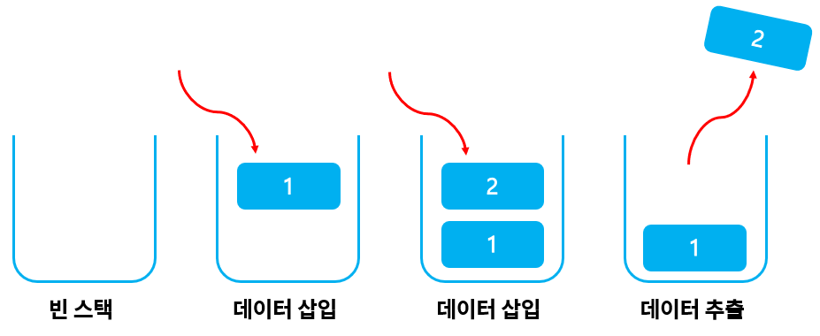

# 스택

데이터를 저장하고 꺼내기 위해 사용하는 자료구조 중 하나

배열은 index로 접근, 스택은 최근 저장한 데이터만 접근 가능



후입선출 Last In, First Out LIFO

### 스택에 데이터 삽입
`push`: 데이터 저장하는 함수

#### 필요한 요소
- 삽입할 위치: 스택은 인덱스 사용하지 않아 데이터 삽입할 위치 기억해야함
- 최대 크기: 가득 찬 상태인지 아닌지 확인

#### 코드 구현
```java
public class Stack_Push {

    static int max_size = 3;
    static int[] stack = new int[max_size];
    static int top = -1;

    public static boolean isFull() {
        return top >= max_size - 1;
    }

    public static void push(int value) {
        if (isFull()) {
            System.out.println("스택이 가득 찼습니다.");
        } else {
            System.out.println(value + " 삽입 완료");
            stack[++top] = value;
        }
    }

    public static void main(String[] args) {
        push(3);
        push(5);
        push(12);
        push(7);
        push(1);
    }
}
```

### 스택에서 데이터 추출
`pop`: 데이터를 리턴하고, 원본 배열에서 그 데이터를 제거하는 함수

#### 필요한 요소
- 스택이 비어있는지 확인

#### 코드 구현
```java
public class StackPop {

    static int max_size = 3;
    static int[] stack = new int[max_size];
    static int top = -1;

    public static boolean isFull() {
        return top >= max_size - 1;
    }

    public static void push(int value) {
        if (isFull()) {
            System.out.println("스택이 가득 찼습니다.");
        } else {
            System.out.println(value + " 삽입 완료");
            stack[++top] = value;
        }
    }

    public static boolean isEmpty() {
        return top < 0;
    }

    public static int pop() {
        if (isEmpty()) {
            System.out.println("스택이 비었습니다.");
            return 0;
        } else {
            return stack[top--];
        }
    }

    public static void main(String[] args) {
        pop();
        push(3);
        push(5);
        System.out.println("pop: " + pop());
        System.out.println("pop: " + pop());
        System.out.println("pop: " + pop());
    }
}
```

### 스택의 시간복잡도
#### push
스택의 맨 위에 데이터 삽입

스택 내부의 다른 데이터에 접근X = 항상 같은 시간복잡도

O(1)

#### pop
다른 데이터에 접근할 필요없이 항상 맨 위의 데이터만 받아옴 = O(1)


#### 스택의 응용
대부분 프로그램에서 사용하는 Undo(Ctrl+Z)가 대표적인 예시!

프로그램의 변경점을 스택에 넣고 undo 명령어를 실행해 하나씩 데이터를 꺼내오는 것
