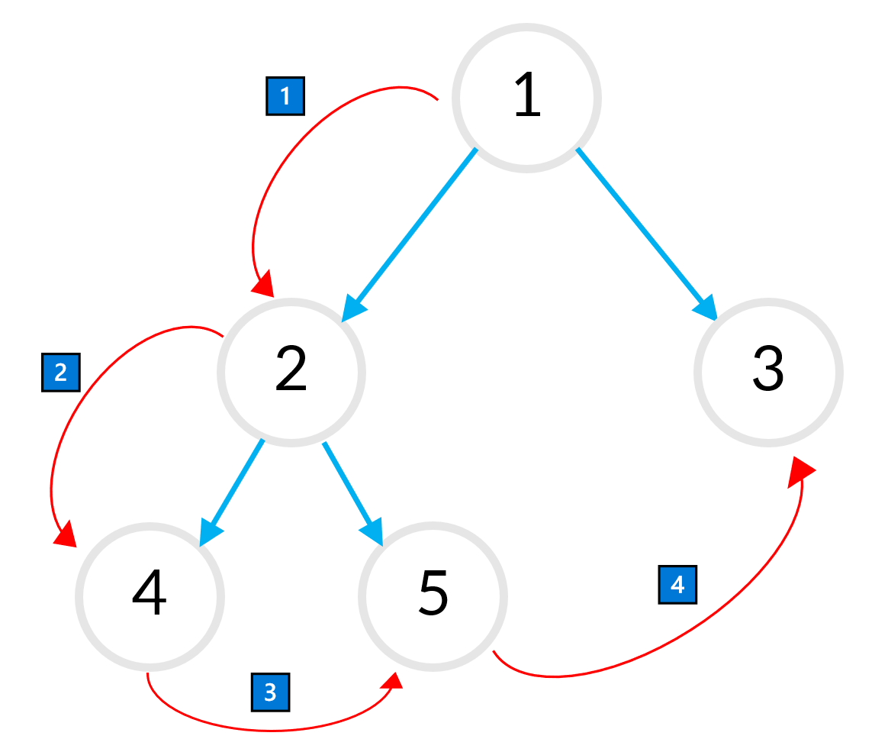

# 트리

#### 선형 자료 구조
배열, 스택, 큐 등
<br><br>
#### 비선형 자료 구조
데이터가 여러 연걸 고리 가짐
<br><br>
### 트리 구조
계층구조를 표현하기 위한 비선형 자료구조


<br><br>

#### 노드, 엣지


- Node 노드: A, B 등과 같이 트리를 구성하는 요소, 정점
- Edge 엣지: 노드 사이를 잇는 연결 선, 간선
  <br><br>

#### 트리, 레벨 깊이


- Level 레벨: 트리의 각 층 별로 숫자를 매긴 것
- Root node: level0에 존재하는 최 상단 노드
- Height 높이: 최 하단 노드에 접근위해 거쳐야하는 edge의 수
  <br><br>

#### 노드 간의 관계


- Parent node 부모노드: 윗 레벨에 존재하는 노드
- Child node 자식노드: 부모노드와 연결된 노드
- Sibling node 형제노드: 같은 부모 노드를 갖는 여러 자식 노드 사이 관계

<br><br><br>

### 트리의 특성
부모노드에서 분리한 자식노드도 트리의 형태를 가짐<br>
= 재귀적인 성질 지님

한 노드 X와 그 자식 노드로 구성된 트리 = X를 루트 노드로 하는 서브트리 sub-tree

### 이진트리
자식 노드의 수가 2개로 제한된 이진트리

#### 이진트리 구현
하나의 노드가 최대 2개의 자식 노드를 가지는 트리<br>
두개의 포인터가 있는 링크드리스트와 같은 구조

```java
class Node {
  int data;
  Node left;
  Node right;

  public Node(int data) {
    this.data = data;
    left = null;
    right = null;
  }
}

public class Tree {
  public static void main(String[] args) {

    Node root = new Node(1);

    Node node2 = new Node(2);
    Node node3 = new Node(3);

    root.left = node2;
    root.right = node3;

    Node node4 = new Node(4);
    Node node5 = new Node(5);

    node2.left = node4;
    node2.right = node5;

    System.out.println(root.data);
    System.out.printf("%d %d\n", root.left.data ,root.right.data);
    System.out.printf("%d %d\n", root.left.left.data, root.left.right.data);
  }
}
```
<br>

#### 결과
```
            1
           2 3
          4 5
```

<br><br><br>

### 트리의 탐색
위에서 구현한 코드의 경우엔 실제 구조도 모르고, 깊이도 모르기때문에 사용하기 어려운 방법
<br><br>

### 전위순회 Preorder
루트노드부터 시작<br>
부모노드 -> 왼쪽 자식노드 -> 오른쪽 자식노드



위의 트리의 경우 1 -> 2 -> 4 -> 5 -> 3 순으로 노드 탐색

구현하려면?<br>
재귀 이용!
<br><br>
#### 전위 순회 알고리즘
1. 노드를 방문
2. 왼쪽 서브 트리 전위순회
3. 오른쪽 서브 트리 전위순회

```java
class Node {
  int data;
  Node left;
  Node right;

  public Node(int data) {
    this.data = data;
    left = null;
    right = null;
  }
}

public class TreeTraversal {
    public static Node initTree() {
        Node root = new Node(1);
        
        Node node2 = new Node(2);
        Node node3 = new Node(3);

        root.left = node2;
        root.right = node3;

        Node node4 = new Node(4);
        Node node5 = new Node(5);

        node2.left = node4;
        node2.right = node5;

        return root;
    }

    /**
     * 전위 순회 함수
     */
    public static void preorder(Node node) {
        if (node == null) return;

        // 부모노드 -> 왼쪽자식노드 -> 오른쪽자식노드 순서로 탐색
        System.out.println(node.data);
        preorder(node.left);
        preorder(node.right);
    }

    public static void main(String[] args) {
        Node root = initTree();
        preorder(root);
    }
}
```

#### 결과
```
1 -> 2 -> 4 -> 5 -> 3
```
<br><br><br>

### 중위순회 Inorder
왼쪽 자식 노드부터 시작

왼쪽 자식노드 -> 부모노드 -> 오른쪽 자식노드


```java
...
/**
 * 중위 순회 함수
 */
public static void inorder(Node node) {
  if (node == null) return;
  
  // 왼쪽 자식 노드부터 시작
  // 왼쪽자식노드 -> 부모노드 -> 오른쪽자식노드
  inorder(node.left);
  System.out.println(node.data);
  inorder(node.right);
}

public static void main(String[] args) {
  Node root = initTree();
  inorder(root);
}
...
```

#### 결과
```
4 -> 2 -> 5 -> 1 -> 3
```

<br><br><br>

### Postorder 후위 순회 함수
왼쪽노드부터 시작

왼쪽노드 -> 오른쪽노드 -> 부모노드


```java
/**
 * 후위 순회 함수
 */
public static void postorder(Node node) {
  if (node == null) return;
  
  // 왼쪽자식노드 -> 오른쪽자식노드 -> 부모노드
  postorder(node.left);
  postorder(node.right);
  System.out.println(node.data);
}

public static void main(String[] args) {
  Node root = initTree();
  postorder(root);
}
...
```

#### 결과
```
4 -> 5 -> 2 -> 3 -> 1
```