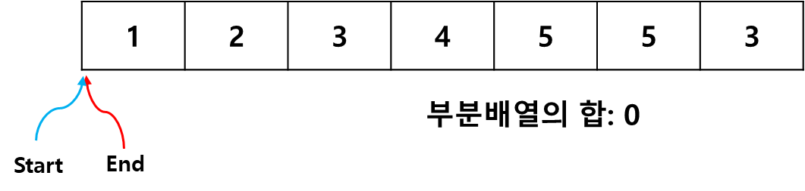
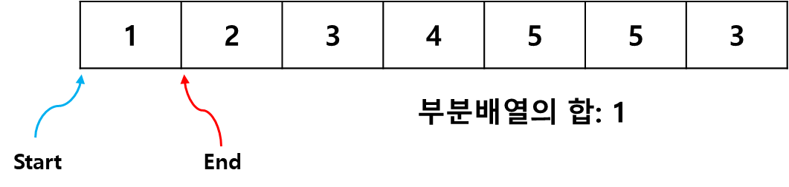
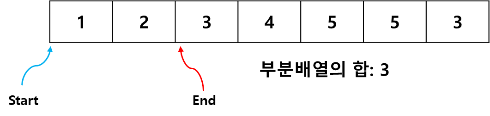
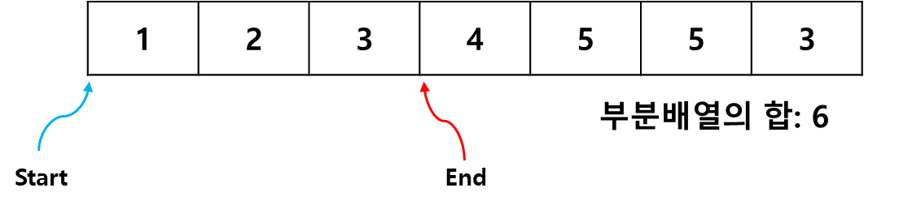
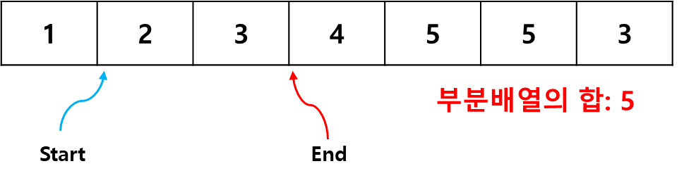
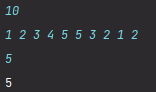

# 투 포인터 Two Pointers

1차원 배열에서 두개의 포인터를 조작해 문제에서 원하는 결과를 얻어내는 알고리즘

### 예시
연속된 수 n개로 구성된 수열이 입력</br>
이 수열의 i번째 수부터 j번째 수까지 합이 m이 되는 경우의 수?

- 첫째 줄: n
- 둘째 줄: 공백으로 구분된 n 개의 수 입력
- 셋째 즐: 목표값 m

**입력 예시**
```
10
1 2 3 4 5 5 3 2 1 2
5
```
**출력 예시**
```
5
```

#### 1차풀이
```java
int count = 0;

for (int i, 0 ~ arr.length) {
    for (int j, 0 ~ arr.length) {
        if (arr[i] ~ arr[j] 부분합이 m) count++;
    }
}
```
위의 답안에서 if문 내의 합을 구하는 식도 for문을 사용해야함<br>
즉, 3중 반복문을 사용하는 답이 됨 = _**O(n^3) 의 시간복잡도_**

### 투 포인터 알고리즘의 원리
start, end 라는 두 개의 포인터 = 인덱스를 통해 문제에서 원하는 결과를 도출

두 인덱스 모두 배열의 시작점인 0의 값을 가지고 다음과 같은 조건에 따라 동작

- start부터 end범위의 부분 배열의 합을 구한다.<br>
- 부분 배열의 합이 목표 값보다 작거나 같다면 end를 오른쪽으로 이동 시킨다.<br>
- 부분 배열의 합이 목표 값보다 크다면 start를 오른쪽으로 이동 시킨다.<br>
- 단, end가 배열의 끝에 도달하면 start를 오른쪽으로 이동 시킨다.

#### 과정
1️⃣ Start: 0, End : 0



Start, End가 0으로 시작

현재 부분 배열의 합은 0 = 목표 값보다 작음

-> 따라서 End를 오른쪽으로 이동

2️⃣ Start: 0, End: 1



부분 배열의 합이 1

But, 아직도 목표 값보단 작음

다시 End를 오른쪽으로 이동

3️⃣ Start: 0, End: 2



위와 동일하게, 배열의 합이 3이므로 End를 오른쪽으로 이동

4️⃣ Start: 0, End: 3



End를 계속해서 이동 -> 부분 합 6

=> 목표 값보다 큼

목표 값보다 커지면 Start를 오른쪽으로 이동

5️⃣ Start:1, End : 3



목표 값을 만족하는 부분 배열의 합 출력

부분 배열의 합이 목표 값과 같으면 다시 End를 이동

6️⃣ 위의 과정 반복


반복하다가 start가 배열의 끝에 도달하는 지점에서 알고리즘 종료

### 투포인터로 코드 변경
```java
import java.util.Scanner;

public class TwoPointers {
    
    public static void main(String[] args) {
        Scanner sc = new Scanner(System.in);

        int n = sc.nextInt();
        int[] arr = new int[n];

        for (int i = 0; i < n; i++) {
            arr[i] = sc.nextInt();
        }

        int m = sc.nextInt();

        int start = 0;
        int end = 0;

        int partial_sum = 0;
        int answer = 0;

        while (start < n) {
            if (partial_sum > m || end >= n) {
                partial_sum -= arr[start++];
            } else if (partial_sum <= m) {
                partial_sum += arr[end++];
            }

            if (partial_sum == m) answer++;
        }
        System.out.println(answer);
    }
}
```
**결과**



기존의 3중 반복문을 하나의 while문으로 대체 가능

시간복잡도도 줄어듦

**일차원 배열에서 연속된 값을 사용**하는 거의 모든 문제에 응용 가능
